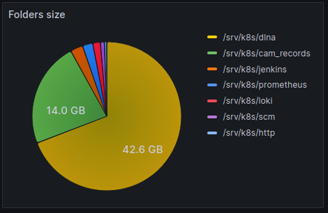

# folder-size-exporter
Folders size exporter written in Rust. This tool exports the defined folders size in an exposed prometheus metrics format.

## Intallation steps:

Precompiled binary can be found here: https://github.com/denix666/folder-size-exporter/releases


Download, extract and place it under __/usr/local/bin/folder-size-exporter__


Create the configuration file: __/etc/folder-size-exporter/config.json__
```json
{
    "bind": "0.0.0.0",
    "port": 9978,
    "metrics_path": "/metrics",
    "folders": [
        "/path/to/folder1",
        "/some/other/folder",
        "/additional_one"
    ]
}
```

Create systemd unit: __/etc/systemd/system/folder-size-exporter.service__
```shell
[Unit]
Description=Folder size exporter
Wants=network-online.target
After=network-online.target

[Service]
Type=simple
ExecStart=/usr/local/bin/folder-size-exporter

[Install]
WantedBy=multi-user.target
```

Enable and start the daemon:
```shell
systemctl enable folder-size-exporter.service --now
```

Open and check in browser the metrics exposed: http://127.0.0.1:9978/metrics


#### Grafana dashboard example:
